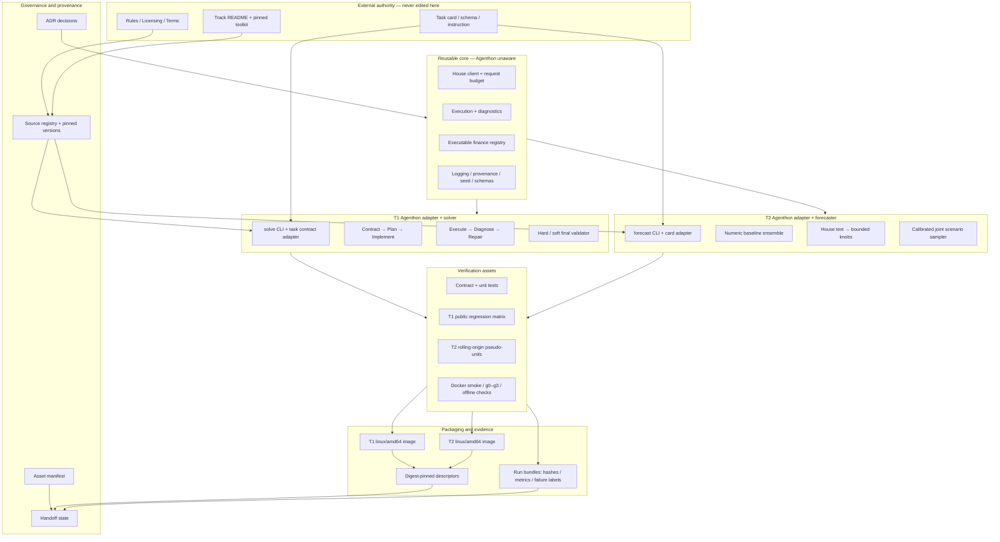

# Agenthon 2026 Agents — Asset Architecture Map

Status: `baseline-v0.1`  
Purpose: define where every project asset belongs before implementation begins.

## Authority and asset flow



## Canonical directory ownership

```text
agenthon-2026-agents/
├── README.md                         Project entrypoint and current phase
├── ASSET_MANIFEST.md                 Canonical inventory and ownership
├── sources/                          Immutable research/source snapshots
├── upstream/                         Pinned official repos and toolkit
├── docs/
│   ├── architecture/                 Architecture maps and boundaries
│   ├── decisions/                    Versioned ADRs
│   └── handoff/                      Current state, next action, open risks
├── core/                             Reusable code with no Agenthon imports
├── tracks/
│   ├── t1_agenthon/                  T1 adapter and universal solver
│   └── t2_agenthon/                  T2 adapter and forecasting pipeline
├── packaging/
│   ├── t1/                           T1 Docker and submission descriptor
│   └── t2/                           T2 Docker and submission descriptor
├── tests/
│   ├── contracts/                    CLI/schema/policy tests
│   ├── integration/                  Exemplars, smoke and offline checks
│   ├── regression/t1/                Public-practice regression matrix
│   └── backtests/t2/                 Rolling-origin pseudo-units and metrics
└── evidence/
    ├── manifests/                    Version, image and input/output hashes
    ├── runs/                         One bounded evidence bundle per run
    └── reports/                      Human-readable acceptance summaries
```

## Runtime boundaries

- `core/` must not import Agenthon track packages or know official CLI paths.
- `upstream/` contains pinned official material only; local implementation never edits it.
- `tracks/` translates official contracts into core interfaces and translates results back.
- `packaging/` contains container/submission concerns only; it must not contain agent intelligence.
- `sources/` is append-only. Derived implementation does not overwrite source snapshots.
- `evidence/runs/` records metadata and concise diagnostics, never credentials or House tokens.
- Every new top-level asset must be registered in `ASSET_MANIFEST.md` and assigned an owner/status.

## Handoff invariant

A successor should be able to determine, without reading chat history:

1. which official versions and policies govern the build;
2. which ADRs are frozen or still experimental;
3. where T1/T2 source, tests, packaging and evidence live;
4. the latest verified gate for each track;
5. the next safe action and unresolved risks.
